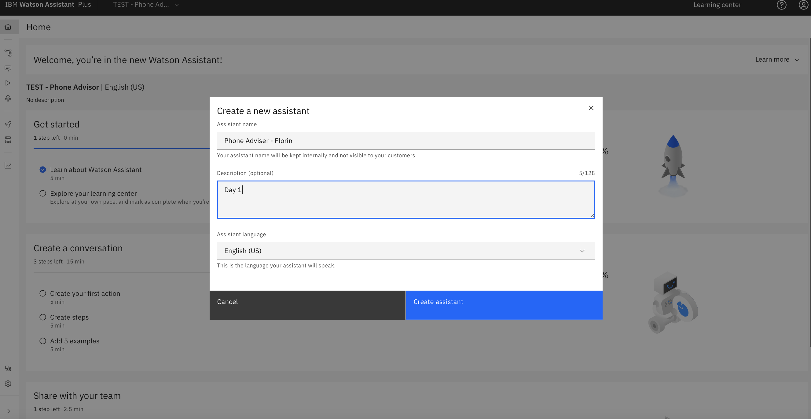
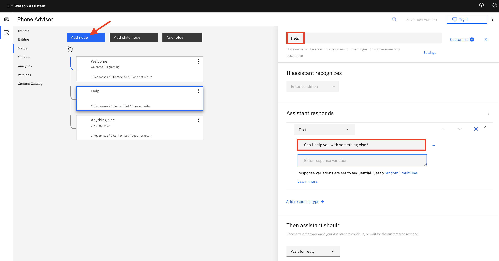
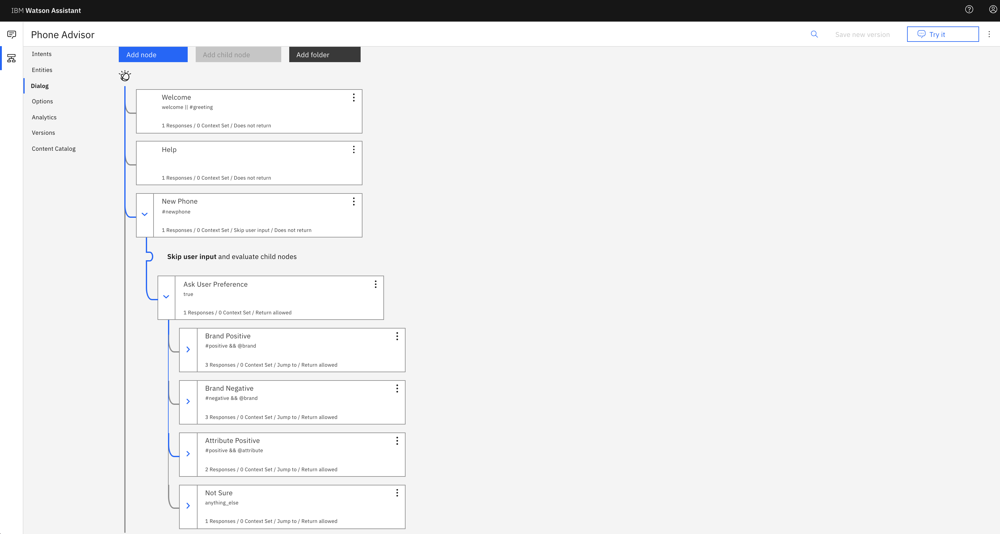
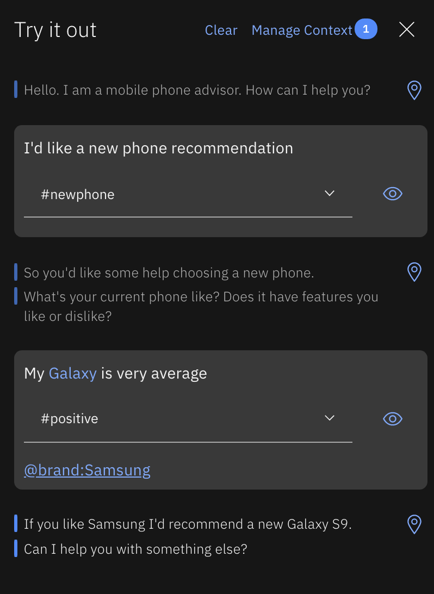

# Chatbot Basics**
In this lab we'll start to build a chatbot, by using the building blocks of _Watson Assistant_ to create a function that can recommend a new mobile phone for a user, based on their experience and feedback when using previous models.

## Requirements
- [IBM Cloud account](https://cloud.ibm.com/)

## Agenda
- Understanding user _intent_
- Introducing _entities_
- Building responses with a _dialog tree_
- Testing within _Watson Assistant_
- Adding rich content: _sending images_

**[1.3]** <kbd>Click on **Launch Watson Assistant**.</kbd>

<kbd>Click **+** on top right in order to create a new Chat Bot, and chose **Phone Adviser - YourName**.</kbd>

## Understanding user _**intent**_
An _**intent**_ represents the **purpose** of a user's input. By recognising the _intent_ expressed by a user, _Watson Assistant_ can choose the correct _dialog_ flow to use to provide a suitable and meaningful response. To plan the _intents_ for your chatbot, you need to consider what your users might want to do, and what you want your chatbot to be able to handle.

Before we get onto intents, the first thing we need to do in _Watson Assistant_ is to enable a _**dialog skill**_. A _**skill**_ contains the training data and machine learning logic that enables your chatbot to understand and help users and customers.

**[2.1]** <kbd>Click on the **Settings icon** in the sidebar, then **Enable Dialog**. </kbd>

<kbd>Ensure **Dialog skill** is selected, then hit **Activate Dialog**.</kbd>

<kbd>From **Dialog** select **Intent**, then hit **Create Intent**.</kbd>

Now we'll go on to create the constructs required for our chatbot: _**Intents**_, _**Entities**_ and _**Dialogs**_.

**[2.2]** We'll start by creating the chatbot _**intents**_.

Choosing the correct _intent_ for a user's input is the first step in providing a useful response. The _intents_ you identify for your application will determine the dialog flows you need to create; they also might determine which back-end systems your application needs to integrate with in order to complete customer requests (such as customer databases or payment-processing systems).

<kbd>Select **Create Intent** to get started, and create an _intent_ name of **greeting**. </kbd>

You can add a description for your _intent_ here as well if you wish.

**[2.3]** <kbd>Now add multiple **user examples** of how a user might greet your bot.</kbd>
- `hi`
- `hello`
- `good morning`
- `good afternoon`
- `good evening`

_Feel free to add a few more variations of your own._

**[2.4]** <kbd>When you've done, click on the arrow at the top left of the screen to go back.</kbd>

<kbd>Now select **Create intent** to repeat the process for our next _intent_ named **positive**:</kbd>

- **Intent name:** `positive`
- **Description:** `Expressing positive opinion about mobile phones`
- **User examples:**
  - `Style is important to me`
  - `I care about looks`
  - `I like Galaxy phones`
  - `I love Apple`
  - `I need good battery life`
  - `I prefer Google`
  - `I want a good looking phone`
  - `I want a great battery`
  - `The new Samsung looks great`

What we are doing here is providing _Watson Assistant_ with examples of _what a user might say_ when they are expressing a positive opinion about a particular phone brand, or the key attribute they are looking for in a phone. As with any machine learning or cognitive service, the more examples you provide - _a larger training set_ - the more accurate your chatbot will be in identifying user intent.

Your `positive` _intent_ should look something like this:

**[2.5]** <kbd>Repeat this process twice more, for the following _intents_:</kbd>

- **Intent name:** `negative`
- **Description:** `Expressing negative opinion about mobile phones`
- **User examples:**
  - `Google sucks`
  - `Apple is the worst`
  - `I don't care about style`
  - `I'm not bothered about battery life`
  - `Not concerned with looks`
  - `I do not like iPhones`
  - `I hate Samsung`

- **Intent name:** `newphone`
- **Description:** `Expressing intent to buy or get advice about buying a new phone`
- **User examples:**
  - `I am interested in buying a new phone`
  - `I'm looking for a new phone`
  - `I need a new phone`
  - `I want advice regarding phones`
  - `I'd like to replace my phone`
  - `Can you recommend a phone`
  - `What's the best phone available`

Once you've created these, your _Intents_ screen should look something like this:

## Introducing _**entities**_
Now let's create some **_entities_**.

An _**entity**_ represents a term or object in the user's input that provides **context** for a particular _intent_. If _intents_ represent _verbs_ (something a user wants to do), _entities_ represent _nouns_ (such as the object of, or the context for, an action).

_Entities_ make it possible for a single _intent_ to represent multiple specific actions. For example in our case, the `positive` _intent_ can be used with _entities_ to recognise positive feeling about _different_ mobile phones or their attributes. So in effect, an _entity_ defines _a class of objects_, with specific values representing the possible objects in that class.

**[3.1]** <kbd>Select **Entities** from the menu bar, then **Create Entity**.</kbd>

<kbd>Next enter an _entity_ name of **brand** and hit **Create Entity**.</kbd>

**[3.2]** <kbd>Enter a value name of **Apple**, and then select **Recommend synonyms**.</kbd>

_Watson Assistant_ can also recommend _**synonyms**_ for your _**entity**_ values. The recommender finds related _synonyms_ based on contextual similarity extracted from a vast body of existing information, and uses natural language processing techniques to identify words similar to the existing _synonyms_ in your _entity_ value.

As you might expect, _synonyms_ allow us to use multiple values to represent a single value. In this case, we will translate the use of either _Apple_ or _iPhone_ to a `@brand` value of `Apple`.

<kbd>Select **iphone** from the list presented, and then hit **Add selected**.</kbd>

<kbd>Now select **Add value** to add _Apple_ to your **@brand** entity.</kbd>

**[3.3]** <kbd>Repeat the process for these values:</kbd>

- <kbd>**Google** (with _synonym_ **pixel**)</kbd>
- <kbd>**Samsung** (with _synonyms_ **galaxy**, **j3**, **a8** and **edge**)</kbd>

Note that you can add your own _synonyms_ too. You'll need to do this when adding the _Samsung_ and _Google_ values and their _synonyms_ to your `@brand` entity, like so:

Feel free to include more phone brands here if you like. When you've finished it should look something like this:

**[3.4]** You can also use _**pattern matching**_ when creating _entity_ values. This is really helpful if you want to pick up _entities_ that have specific formats, e.g. phone numbers or website addresses.

Take a look at the [Watson Assistant documentation](https://cloud.ibm.com/docs/services/assistant/entities.html#creating-entities) if you want to know more.

**[3.5]** <kbd>Create another _entity_, named **attribute**, with the following values.</kbd>

 - <kbd>**battery** (with _synonym_ **battery life**)</kbd>
 - <kbd>**style** (with _synonyms_ **looks**, **stylish**, **fashion**)</kbd>

## Building responses with a _**dialog tree**_
The next step is to create a _**dialog**_ tree.

A _**dialog**_ uses the _intents_ and _entities_ that are identified in the user's input, plus _context_ from the application that uses _Watson Assistant_, to interact with the user and ultimately provide a useful response. Our _dialog_ tree should help the user choose a new mobile phone based on an existing preference, or a characteristic identified as important to the user.

**[4.1]** <kbd>Select **Dialog** from the menu bar.</kbd>

`Welcome` and `Anything else` nodes will be automatically generated for you. The former is used to initialise the dialog with the user, and the latter catches any user input that we don't provide a specific response for within our chatbot logic.

**[4.2]** Modify the `Welcome` node so it welcomes the user with the message `Hello. I am a mobile phone advisor. How can I help you?`.

<kbd>Select the node, then change the **Then Respond With** field to reflect our new welcome message.</kbd>

<kbd>Next hit the plus sign next to **welcome**, and: </kbd>
- <kbd>change the operator from **and** to **or**</kbd>
- <kbd>add the **#greeting** _intent_ to **If assistant recognizes:**</kbd>

These tests ensure that we will always provide a welcome response when the dialog first starts, or when someone 'greets' the chatbot.

You can leave the `Anything Else` node with its default settings.

**[4.3]** <kbd>Next, create a new dialog node by selecting **Add Node**. </kbd>

<kbd>Name it **Help**, and set the response to **Can I help you with something else?**. </kbd>

We'll use this node to ask the user if they want to ask another question, _after we've satisfied a previous query_.

**[4.4]** Now we'll construct a `New Phone` node, which will pick up the user's _intent_ to ask for help with a new phone recommendation. When we spot this _intent_, we'll ask the user what they are looking for in a new phone, and then look for `positive` or `negative` responses based on our previously built _intents_, as well as picking up either a `brand` name or a phone `attribute` defined by our _entities_.  Our recommendation to the user will then differ, and will be based on the information they have provided.

<kbd>Select the **three dots** on the **Help** node, then **Add node below**.</kbd>

_Note: the ordering of dialog nodes is important, as they are processed (checked) in sequential order from top to bottom._

<kbd>Call this new node **New Phone**, and it should be invoked if the **#newphone** _intent_ is recognised. </kbd>

<kbd>Add a couple of responses confirming that the chatbot understands, in the **Then Respond With** field:</kbd>
- <kbd>I understand you want to choose a new phone.</kbd>
- <kbd>So you'd like some help choosing a new phone.</kbd>

<kbd>Now click **Set to random**.</kbd>

This will randomly present one of these two responses to the user when we pick up the `#newphone` intent, adding a bit of variety to the conversation!

**[4.5]** Next add a _**child node**_ to your `New Phone` node, by one of these two methods:

- <kbd>Select the **New phone** node and choosing the **Add Child Node** option at the top of the dialog tree </kbd>
- <kbd>Select the three dots on the **New phone** node and then **Add Child Node** from the popup menu.</kbd>

<kbd>Call this child node **Ask User Preference**, ensure it is called **If assistant recognizes** is equal to **true**.</kbd>

<kbd>Enter these two responses:</kbd>
- <kbd>What's your current phone like? Does it have features you like or dislike?</kbd>
- <kbd>Tell something good or bad about your current phone, or what particular attributes you like in a phone.</kbd>

Using `true` in this way ensures we will **always** execute the logic in a node (i.e. we're not going to test for any conditions). In this case it means we'll send one of these two responses _whenever_ we reach this point in the dialog.

This node is asking the user what they like/dislike about their phone. We'll add some more logic to this soon, but in order to drop into this child node directly from the `New Phone` node (i.e. without waiting for a further user response), we need to instruct the `New Phone` node to not wait for any user input.

<kbd>Select the **New phone** node and change the **Then assistant should** option to **Skip User Input**.</kbd>

**[4.6]** Finally, we need to create **four** child nodes of the `Ask User Preference` node that will ultimately decide the chatbot's response to the user's input. When completed it will look like this:

When completed, `New Phone` dialog flow will work something like this:
- pick up the `#newphone` _intent_ from the user's input
- confirm to the user that we understand their request
- ask the user to provide feedback on their current phone
- based on that input
  - if we spot `positive` comments about a brand, recommend a new model within that brand
  - if we spot `negative` comments about a brand, recommend models from another brand
  - if we recognise an important `attribute` a user needs, make a recommendation based on that

**[4.7]** The `Brand Positive` node should recognise a `#positive` _intent_ together with a `@brand` _entity_ - essentially we are looking for positive feelings about a brand - and then respond with a recommendation.

<kbd>Add a child node to the **Ask User Preference** node. </kbd>

First we need to ensure that we allow for **multiple responses** in our new node:
- <kbd>select the new child node</kbd>
- <kbd>click **Customize** at the top right</kbd>
- <kbd>on the popup window, ensure **Multiple conditioned responses** is set to **On**</kbd>
- <kbd>hit **Apply**</kbd>

Doing this allows us to send different responses to the user from a single _dialog_ node, depending on the _context_ of their input. In this first example, we are picking out that the user is saying something positive about a particular brand, so our response will be relevant to that brand.

<kbd>Name the node **Brand Positive**, and ensure it's called **If assistant recognizes** both a **#positive** _intent_ **and** a **@brand** _entity_. </kbd>

<kbd>Configure the responses like this:</kbd>

If assistant recognizes  |  Respond with
--|--
`@brand:Apple`  |  `If you like Apple you could get the iPhone XR.  It's pretty cool.`
`@brand:Google ` |  `A Google fan, huh?  I'd probably go for the Pixel 3.`
`@brand:Samsung`  |  `If you like Samsung I'd recommend a new Galaxy S9.`

After we've provided a response to the user, we want to make sure we ask them if they need any more help.

<kbd>Edit the **Then assistant should** section so that we **Jump to** to our **Help** node. </kbd>

<kbd>Choose **Respond** after you've selected **Help** as the destination node for the jump.</kbd>

**[4.8]** Now let's create the `Brand Negative` child node. It should look pretty much like `Brand Positive`, except it will test for a `#negative` _intent_ and a `@brand` _entity_.

<kbd>**Duplicate** the **Brand Positive** node.</kbd>

- <kbd>Change the node name to **Brand Negative**</kbd>
- <kbd>Change the _intent_ from #positive to **#negative**</kbd>
- <kbd>Change the responses to the ones below, reflecting the negative sentiment recognised about a brand</kbd>

If assistant recognizes  |  Respond with
--|--
<kbd>@brand:Apple </kbd> |  <kbd>If you don't like Apple you could go for an Android phone, maybe a Samsung Galaxy S9 or Google Pixel 3.</kbd>
<kbd>@brand:Google</kbd>  |  <kbd>If you don't like Google but want to stay with Android, try a Samsung Galaxy S9, or if you fancy a change, maybe a new iPhone XR?</kbd>
<kbd>@brand:Samsung</kbd>  |  <kbd>If you want to steer away from Samsung but stay with Android then you could try a Google Pixel 3, or for a change you could go for a new iPhone XR.</kbd>

**[4.9]** <kbd>Create an **Attribute Positive** child node by using **Duplicate** again.</kbd>

<kbd>Customise it to look for **#positive** _intent_ and an **@attribute** _entity_, using responses similar to these:</kbd>

If assistant recognizes  |  Respond with
--|--
`@attribute:battery ` |  `If you need a long battery life then go retro! There's an updated Nokia 3310 out now.`
`@attribute:style`  |  `Beauty is in the eye of the beholder... but the Huawei P20 Pro looks very cool.`

**[4.10]** The final child node should be a catch-all for any user input we don't understand in this _dialog_ branch.

<kbd>Select **Add node below** from your **Attribute Positive** node.</kbd>

- <kbd>Call the new node **Not Sure**</kbd>
- <kbd>Use **anything_else** for **If assistant recognizes**</kbd>
- <kbd>Assistant should respond with **I'm not sure I understand.**</kbd>

This time, because we know the user **is** interested in a phone recommendation but _we couldn't classify their feedback_ regarding their existing phone, instead of jumping to the `Help` node, we should ask the user to try providing feedback again, by jumping back to the `Ask User Preference` node.

<kbd>Do this by setting **Then assistant should** to **Jump to** , then select the **Ask User Preference** node and **Respond**.</kbd>

## Testing within _Watson Assistant_
You can test your _dialog_ inside the _Watson Assistant_ application.

**[5.1]** <kbd>Select the **Try It** button at the top right of the screen to enter the _dialog_ tester.</kbd>

**[5.2]** Try and test all of your _dialog_ branches. It'll look something like this:

See how _Watson Assistant_ is picking out the _intents_ and _entities_ it sees in the user input, and responds accordingly.

**[5.3]** If you enter something _Watson Assistant_ _doesn't_ recognise - or if it's interpreting it incorrectly - you have the chance to further **train** Watson.

<kbd>Use **Try It** again and hit **Clear** to restart the dialog test.</kbd>

<kbd>Enter **I'd like a new phone recommendation**, followed by **My Galaxy is very average**.</kbd>

You'll see that _Watson Assistant_ is currently seeing this as _positive_ statement, when in reality it's probably a fairly _negative_ one.

So we understand that saying something is _'very average'_ is probably indicative of a `negative` user intent, we can select `#negative` from the drop down menu:

When we do this, Watson **retrains** our _skill_ by adding this text as another example to our `#negative` _intent_. After training is complete, a similar user response will now work! If you check your `#negative` _intent_ you'll also see that the new example has been added to it.

_**Well done!**_

You've built a basic virtual assistant that understands user _intent_, can pick out _entities_, and responds differently depending on user feedback.  You've also seen how you can easily **train** _Watson Assistant_ so it can continue to improve, and provide a better user experience.

## Adding rich content: sending images
As well as text, you can also return responses that include multimedia or interactive elements such as _**images**_ or clickable _**option**_ buttons, to simplify interaction within your chatbot and enhance the user experience. In this next section we'll enhance our chatbot so that it can respond to users using images as well as text.

In addition to the default response type of _**Text**_, the following response types are also supported in _Watson Assistant_:

_**Image**_: Embeds an image into the response. The source image file must be hosted somewhere and have a URL that you can use to reference it. It cannot be a file that is stored in a directory that is not publicly accessible.

_**Option**_: Adds a _list_ of one or more options. When a user clicks one of the options, an associated user input value is sent to the service. We'll add some _options_ to our chatbot later.

_**Pause**_: Forces the application to _wait_ for a specified number of milliseconds before continuing with processing. You might use this response type if you need to perform an action that might take some time, for example, if a parent node makes an external API call that takes a few seconds to respond.

Let's add some images to our existing responses.

**[6.1]** <kbd>Select the **Brand Positive** dialog node, and then the **Customize Response** icon for the **@brand:Apple** response.</kbd>

**[6.2]** <kbd>Select **Add response type** and then **Image** from the newly presented drop-down menu.</kbd>

**[6.3]** <kbd>Enter **iPhone XR** as the **Title**, use **https://bit.ly/2o9LfQY** as the **Image source**, and hit **Save**. </kbd>

If you enter this URL into a web browser you should see an image of an _iPhone XR_. You can use any image URL you like here of course - try searching [Google Images](https://images.google.co.uk/) if you want to use your own.

**[6.4]** <kbd>Test this out by using the **Try It** tool again. </kbd>

When the user says something positive about Apple phones, they now also get an image of the recommended device:

**[6.5]** <kbd>Complete the **New Phone** dialog now by adding images to **all** responses.</kbd>

You can find your own images to add to your skill, or use the ones listed below.

<kbd>For the **Brand Positive** node:</kbd>

Brand   | Title     | Image source
--------|-----------|-----------------------
Apple   | `iPhone XR` | `https://bit.ly/2o9LfQY`
Google  | `Pixel 3`   | `https://bit.ly/2EhAuC1`
Samsung | `Galaxy S9` | `https://bit.ly/2XmP1pR`

**[6.6]** For the `Brand Negative` node, ensure you display **both** of the options we suggest in our text response to the user, using the same **Title** and **Image source** values as above.

<kbd>As an example, the **@brand:Apple** response should look like this:</kbd>

**[6.7]** <kbd>For the **Attribute Positive** node, use these values:</kbd>

Attribute | Title            | Image source
----------|------------------|-------------------------
Battery   | `Nokia 3310 `    | `https://bit.ly/2RX48kj`
Style     | `Huawei P20 Pro` | `https://bit.ly/2BdHME0`

**[6.8]** <kbd>Test out your _dialog_ again using the **Try It** button.</kbd>

Here's how it should look:

**[6.9]** If you need to you can download the _Watson Assistant_ _skill_ we've created so far from [here](./assistant/skill-Phone-Advisor-lab-1.json).

There's an `Import Skill` option available whenever you create a new skill - it will be useful when you are backing up, exchanging skills, etc.:

  

## Summary
_**Well done! You've created your first basic chatbot that understands user intent, can pick out entities, and responds differently depending on user feedback, using both text and images.**_

The next lab will show you how to actually get your chatbot in front of your users, using multiple _**integration**_ points.

_**Now go to [Lab 2: Deploying Your Chatbot](../2-Integrations) to get your chatbot working in a live environment.**_
