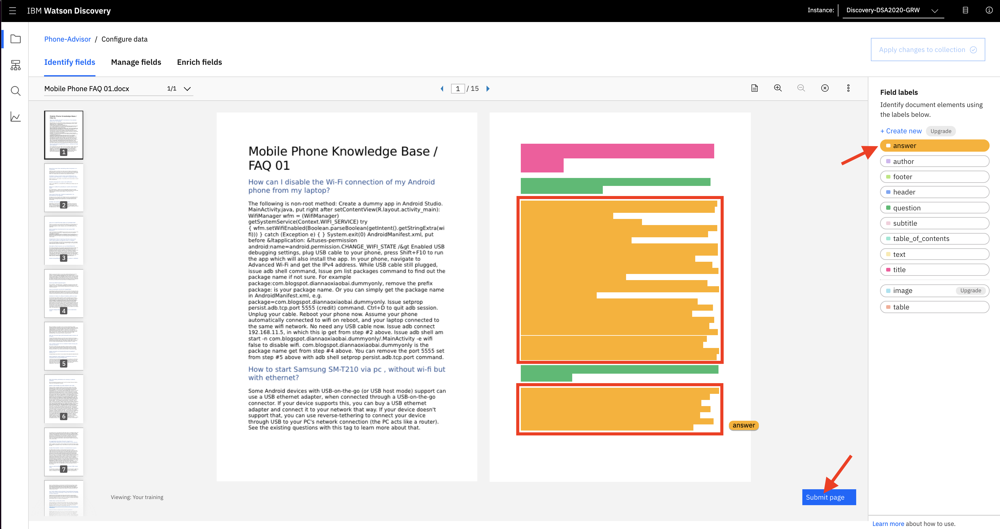
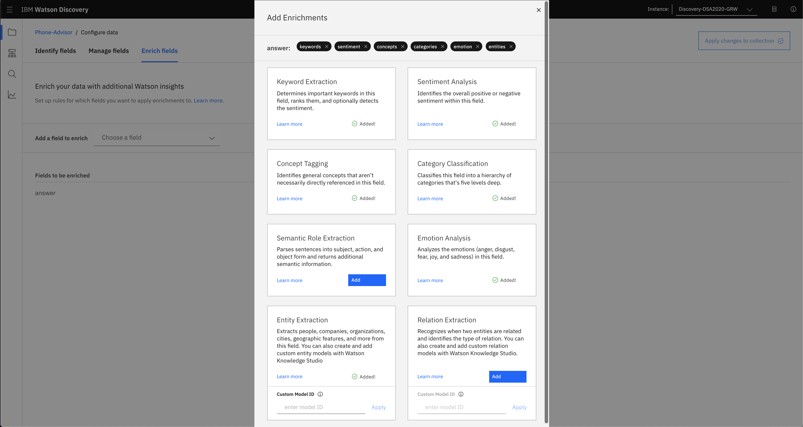
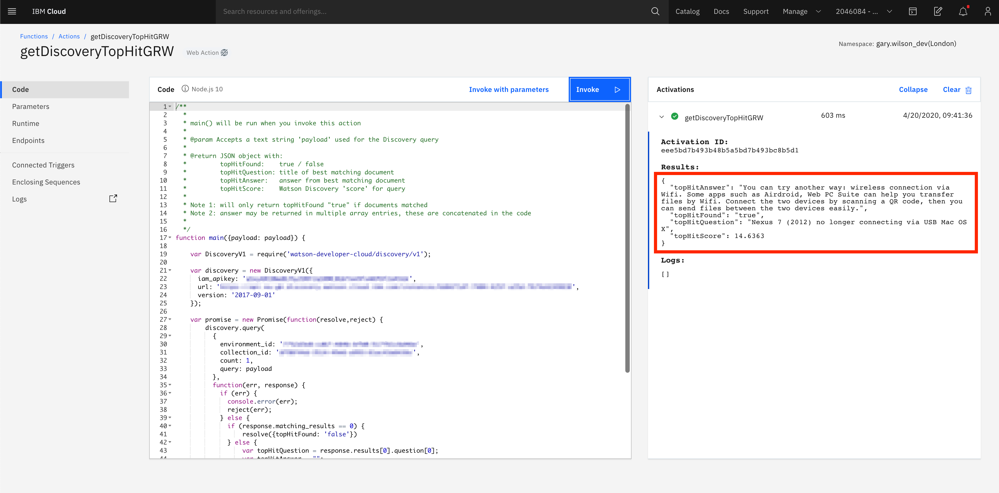

# **Extending Your Chatbot with _Watson Discovery_**
This part will focus on extending your simple chatbot to handle _long-tail_ conversations, by using the _Watson Discovery_ service.

## Requirements
- Successful completion of the privious part.

## Agenda:
- Introduction to _Watson Discovery_
- Build a _Discovery_ document _collection_
- Query the collection using _Watson Discovery Query Builder_
- Create a _Watson Discovery_ _IBM Cloud Function_
- Integrate _Watson Discovery_ with _Watson Assistant_

## Introduction to _Watson Discovery_
IBM _Watson Discovery_ makes it possible to rapidly build cognitive applications that unlock actionable insights hidden in **unstructured** data — including your own proprietary data, as well as public and third-party information.

With _Watson Discovery_, it only takes a few steps to _prepare_ your unstructured data, create a _query_ that will pinpoint the information you need, and then _integrate_ those insights into your new application or existing solution. _Discovery_ facilitates all this by:

- automatically _crawling, converting, enriching and normalising_ your data
- _applying additional enrichments_ such as concepts, relations, and sentiment through _Natural Language Understanding (NLU)_


So far our chatbot has been trained using _Watson Assistant_ to recognise a number of user _intents_, and to provide a customised response based on a developing user conversation. These are what we call _short-tail_ responses - ones that we expect to have to deal with more often, and can therefore provide a _guided_ experience for the user, and a custom response.

Clearly it's not possible to provide a detailed _Watson Assistant_ _dialog_ for **every** question a user might ask, especially if those questions are very specific, or not likely to be asked very often. However, _Watson Discovery_ is great at being able to trawl larger collections of data and documents to find answers to these more specific _long-tail_ questions, and combining _Watson Assistant_ and _Watson Discovery_ together makes for a powerful solution.

In this lab, we are going to use _Watson Discovery_ to build a _corpus_ of more detailed, specific questions a mobile phone user might ask a support centre operative. So as well as being guided to recommendations on new phones and contracts, a user will be able to ask more specific support-type questions like:
- _"Do incognito tabs stay active after shutdown"_
- _"My Nexus 7 can't connect to my Mac"_
- _"How do I know my compass is pointing the right way?"_
- _"Can I keep reinstalling apps I've bought from the market?"_
- "_The GPS on my HTC Desire is not working after upgrading"_

We'll integrate this capability with _Watson Assistant_, by passing any user query that isn't directly picked up by an _intent_ over to _Watson Discovery_, which will then search the repository we've created and return the most appropriate response.


**[1.3]** <kbd>On the **Manage** page, copy and make a note of the **API Key** and **URL**. </kbd>

We'll need these later when we create another _IBM Cloud Function_ that uses the _Discovery_ service.

<kbd>Once you've done that, select **Launch Watson Discovery** to go to the _Watson Discovery_ tooling application.</kbd>

- 

## Build a _Discovery_ document collection
Now let's create a _Watson Discovery_ document _**collection**_. A _collection_ is a group of _**documents**_ that you want to be able to search. _Documents_ contain data of potential use to an application, e.g. question and answer pairs for use by a chatbot, FAQs, webpage documentation etc. _Watson Discovery_ can ingest documents in _PDF, Word, PowerPoint, Excel, JSON_ and _HTML_ formats using a **Lite** plan, and additionally _PNG, TIFF_ and _JPG_ when using **Advanced** plans.

**[2.1]** When you are logged into _Watson Discovery_, you'll see in the tooling that there's a **Watson Discovery News** collection already available. _Discovery News_ is a public data set that has been pre-enriched with cognitive insights from millions of internet news articles.

_Discovery News English_ is automatically updated with approximately 425,000 new articles daily, and the _collection_ can be used for many purposes, including:
- _News alerting_ - create news alerts by taking advantage of the support for _entities_, _keywords_, _categories_, and _sentiment analysis_ to watch for both news, and how it is perceived.
- _Event detection_ - the subject/action/object _semantic role extraction_ of _Discovery_ checks for terms/actions such as "acquisition", "election results", or "IPO".
- _Trending topics in the news_ - identify popular topics and monitor increases and decreases in how frequently they are mentioned.

**[2.2]** We are going to create our own _collection_ from [this dataset](./data/MobilePhoneFAQs.zip) - it contains 10 separate Word documents, with each document containing a number of FAQ-type entries that will help our chatbot answer questions about more **specific** mobile phone related issues.

<kbd>**Download** and **extract** [the dataset](./data/MobilePhoneFAQs.zip) now.</kbd>

If you open any of the documents, you'll see they consist of a list of problems or queries and their potential resolutions. Here's an example of the format:


**[2.3]** <kbd>In _Watson Discovery_ select **Upload your own data**.</kbd>

<kbd>You may be asked a question about setting up your private data - if so, just select **Set up with current plan**.</kbd>


**[2.4]** <kbd>Give your new _collection_ a name (e.g. **Phone-Advisor**) and click **Create**.</kbd>


**[2.5]** _Watson Discovery_ can **enrich** (_add cognitive metadata to_) your ingested documents with semantic information collected by these nine Watson functions, similar to the ones you saw earlier when using _Watson Natural Language Understanding_:
- Entity Extraction
- Sentiment Analysis
- Category Classification
- Concept Tagging
- Keyword Extraction
- Relation Extraction
- Emotion Analysis
- Element Classification
- Semantic Role Extraction

An example of how we might use this as part of a chatbot application would be to use `Sentiment Analysis` to filter out negative sounding answers _before_ our chatbot responds to the user. Another would be to use `Concept Tagging` to allow us to search a _collection_ not just for specific words, but for related _concepts_. For example, if a document mentions _CERN_ and the _Higgs boson_, `Concepts Tagging` will identify _Large Hadron Collider_ as a concept even if that term is _not mentioned explicitly in the document_, and allow us to retrieve that document if we searched for _Large Hadron Collider_.

You can find out more about enrichment [here](https://cloud.ibm.com/docs/services/discovery/building.html#adding-enrichments), and we'll enrich our ingested documents with some of the functions so that you can see how this works in practice.

**[2.6]** On the **Overview** screen, click `select documents`, navigate to the directory holding your extracted Word documents, and open **just** the first document in the list.


**[2.7]** You'll see a _"Processing your data"_ animation for a minute or so, and when the document has successfully uploaded, _Discovery_ displays the information it has learned from ingesting the document into our _collection_, and by applying its default _enrichments_ to the content.


You'll see how to do this shortly, but right now, if we ran a query against this new _collection_ such as `How do I keep the phone screen coming on when it's in my pocket?` or `I want to disable screen notifications`, _Discovery_ can use it's natural language capabilities to find that the answers to these queries are contained within the document _Discovery_ has ingested:


This is great, but what we really want to do is get more **granular** with search results. Rather than returning _a whole document_ that the user then has to search through to find their _specific_ answer, we want to be able to return **just** the relevant paragraph from the document that contains the answer to their question.

We can do this in _Watson Discovery_ by teaching it about the format of our documents, using a cool feature called [Smart Document Understanding](https://cloud.ibm.com/docs/services/discovery?topic=discovery-sdu) (SDU).

**[2.8]** _SDU_ allows you to train _Watson Discovery_ to extract _custom fields_ in your documents. Customising how your documents are indexed when they are ingested into _Discovery_ can improve the results returned by your application.

With _SDU_, you **annotate** fields within your documents to train custom conversion models. As you annotate, _Watson uses machine learning and will even start to predict annotations_.

<kbd>From the **Overview** screen, select **Configure data**.</kbd>


You will then be presented with an editor that will allow you to _visually annotate_ your ingested document. You can mark document _titles_, _subtitles_, _headers_, _footers_, _text_, and even _tables_ and _images_ using the editor. With upgraded versions of _Discovery_, you can also create your own _custom fields_.


In our example, we have a fairly straightforward document that consists of a document title, and several Q&A pairs, so we're just going to use the default **title**, **question** and **answer** fields in our annotation.

**[2.9]** We annotate in _SDU_ by selecting the appropriate `field label`, then selecting the area on the right hand page of the editor that matches the text on the left, using drag-and-drop.

<kbd>Select the **title** field label, then select the area on the right that matches where the title text is on the left:</kbd>


**[2.10]** <kbd>Now select the **question** field label, then the two areas on the right that match _headings that represent questions_ in our document:</kbd>


<kbd>Repeat this process for the text that represents the **answers** to our questions.</kbd>

<kbd>When your editor page looks like this, hit **Submit page**.</kbd>



**[2.11]** You'll then be taken to the second page of the document for annotation. As we've mentioned, _Discovery_ uses machine learning to _predict_ the document format as you go, and as with any ML model, the more data you provide, the more accurate the model becomes.

Depending on how quickly you annotated the first page, the second page could look like this and need full manual annotation:


Or _Discovery_ could have attempted an annotation for you, like so:


<kbd>In the first case, you'd need to _manually annotate_ each **question** and **answer** field as you did on page one. </kbd>

<kbd>If the latter, _check and correct_ Watson's annotations, as they may not be entirely accurate yet due to limited human input!</kbd>

<kbd>Either way, ensure page two looks like this and then hit **Submit page**:</kbd>


**[2.12]** At this point - even after you've provided it with just two pages worth of annotations - Watson's predictions for the format of the rest of the document should be almost, if not 100% accurate.

For example, Watson fully and correctly annotated page three for me:


_Note: if there has been no automatic annotation at this point, try clicking on another page on the left hand side, then clicking back to page 3._

<kbd>Check your own page three now, correct any errors if there are any, then hit **Submit page**.</kbd>

<kbd>Now repeat this exercise for **all of the remaining pages** in the document:</kbd>
- <kbd>check Watson has annotated correctly</kbd>
- <kbd>make any changes if needed</kbd>
- <kbd>click **Submit page**</kbd>

As you submit each page, Watson adds to its machine learning model, and you should find that you need to modify few, if any of the automatic annotations.

<kbd>Once you've submitted all fifteen pages, select **Manage fields**.</kbd>


**[2.13]** Here we can tell _Discovery_ which fields to **index**.

<kbd>As we are only going to search for information in the **question** and **answer** fields, _deselect everything apart from these two_.</kbd>

Also on this configuration screen, we can tell _Discovery_ to **spilt** our document. This is helpful - and provides for better query results - as we can split a document into segments based on fields. Once split, each segment is a separate document that can be enriched, indexed, and returned as a separate query, rather than (as before) returning the whole larger document for a user to search through in order to find their specific answer.

<kbd>Select **Split document**.</kbd>


<kbd>Now select **question** from the dropdown menu.</kbd>

When we do this, we are telliing _Discovery_ to split any ingested documents into segments, with each segment containing a single `question` and it's associated `answer`.


<kbd>Now select **Enrich fields**.</kbd>

**[2.14]** Using these final configuration options, we can specify which fields to apply enrichments to. We'll just apply them to our `answer` field, as this is where most of our content resides.

<kbd>Remove the default enrichment for the unused **text** field:</kbd>


<kbd>Enter **answer** into the **Add a field to enrich** box, then select **Add enrichments**:</kbd>


<kbd>Select the _keyword_, _sentiment_, _concepts_, _categories_, _emotion_ and _entities_ enrichments, then close the window.</kbd>



<kbd>Finally, commit all of these changes by selecting **Apply changes to collection**:</kbd>


**[2.15]** At this point, you will be prompted to `Upload documents` to your collection - this happens every time you make changes to your _Discovery_ configuration, as Watson has to re-ingest your documents when changes are made.

<kbd>Hit **select documents**, and navigate to the folder where your unzipped FAQ documents reside.</kbd>

<kbd>Select them **all** _(including the 01 document you have already uploaded)_, and hit **Open**.</kbd>


Watson now takes these ten Word documents, and using the model you built using _SDU_, _ingests_ all ten, _splitting_ them by question and answer pairs, and adding in the _enrichments_ you specified. Clever stuff, eh?

You'll now be taken back to the `Overview` screen, and **if you refresh your browser**, you'll start to see the number of documents ingested increase up to the final amount of just over 500, which equates to the number of Q&A pairs across all of the ten Word documents.

You'll also see a summary of the enrichments that have been applied to the `answer` field.


Think about this ... based on the quick, visual formatting of just one of our documents, _Watson Discovery_ has been able to ingest and understand the content of all ten.

**[2.16]** One final thing whilst on this screen...

<kbd>Select the **View API Details** icon and make a note of the **Collection ID** and **Environment ID** values presented.</kbd>

We'll need them for the _IBM Cloud Function_ we'll create shortly.


## Query the collection using _Watson Discovery Query Builder_
**[3.1]** Now let's start to look at how we can query the _collection_.

<kbd>Click on **Build your own query**.</kbd>


**[3.2]** <kbd>If you select the **Run query** button</kbd> at the bottom of the screen (having specified no query parameters), you'll see that we return the _total_ number of documents in our _collection_ in the `matching_results` field, and below that, a selection of the actual _documents_ themselves.

<kbd>Select the brackets next to one of the **question** fields</kbd> to see an example of one of the "questions" _Discovery_ has extracted from the Word documents.

<kbd>Do the same with the brackets next to the **answer** field to show its associated "answer".</kbd>


If you do the same with the `enriched_answer` field, you'll see all the metadata _Watson Discovery_ has created from the enrichments you specified, including sentiment analysis of the `answer`, emotion analysis, and extracted categories and keywords.


**[3.3]** Next, we'll make use of our _sentiment analysis_ enrichment by showing how you could, for example, filter out answers that have negative sentiment.

<kbd>Using **Filter which documents you query**, select:</kbd>

  - **Field**: `enriched_answer.sentiment.document.label`
  - **Operator**: `does not contain`
  - **Value**: `negative`

<kbd>At this point also open **More options** and set **Passages** to **No**.</kbd>

_**Passage Retrieval**_ lets you find pieces of information in larger documents that are ingested into _Watson Discovery_, finding relevant snippets from _within a document_ based on your query. For developers, _Passage Retrieval_ can reduce the time that it takes to hand-craft data into consumable units of information for chatbots or search and exploration interfaces. In our case, we already have created _consumable units_ by splitting documents using **Smart Document Understanding**, so _Passage Retrieval_ is not required.

If you run this query you'll now see it returns fewer results (263 in this case) as the `enriched_answer` data is filtered by _positive_ and _neutral_ sentiment only. Scroll down to check a few.


**[3.4]** You can test a _**natural language query**_ of the _collection_ by asking a question in **Search for documents**.

_Discovery_ returns documents in descending order of the `score` it gives each potential match, where `score` is an unbounded measure of the relevance of a particular result. A higher score indicates a greater match to the query parameters.

<kbd>Try **My Nexus 7 can't connect to Mac** as shown in the example here.</kbd>


Note that even though our query is _"My Nexus 7 can't connect to Mac"_, we still get a match with _"Nexus 7 (2012) no longer connecting via USB Mac OS X"_. This is because the natural language processing capabilities of _Watson Discovery_ are taking care of the nuances of language, so that we don't have to specify the exact words that match a document in order to return it from the collection.

For more on building queries, have a look at the tutorial [here](https://cloud.ibm.com/docs/services/discovery/getting-started-query.html#getting-started-with-querying).

You can further improve the **relevancy** of your results by performing **relevancy training** in _Watson Discovery_. Go [here](https://cloud.ibm.com/docs/services/discovery?topic=discovery-improving-result-relevance-with-the-tooling#improving-result-relevance-with-the-tooling) to learn more about this capability.

Now let's build a an _**IBM Cloud Function**_ to query the _collection_, and then incorporate it into our _**Watson Assistant**_ chatbot.

## Create a _Discovery_ _IBM Cloud Function_
**[4.1]** <kbd>Go to _IBM Cloud Functions_ and create a new action via the sidebar menu in _IBM Cloud_, or directly via [this link](https://cloud.ibm.com/openwhisk/create/action). </kbd>

<kbd>Call it **getDiscoveryTopHitXXX**, substituting _**XXX**_ for your initials once more to give the action a unique name.</kbd>

<kbd>Use **Node.js 10** for the runtime.</kbd>


**[4.2]** <kbd>In the code editor delete the default code and replace it with this:</kbd>

```Javascript
/**
  *
  * main() will be run when you invoke this action
  *
  * @param Accepts a text string 'payload' used for the Discovery query
  *
  * @return JSON object with:
  *         topHitFound:    true / false
  *         topHitQuestion: title of best matching document
  *         topHitAnswer:   answer from best matching document
  *         topHitScore:    Watson Discovery 'score' for query
  *
  * Note 1: will only return topHitFound "true" if documents matched
  * Note 2: answer may be returned in multiple array entries, these are concatenated in the code
  *
  */
function main({payload: payload}) {

    var DiscoveryV1 = require('watson-developer-cloud/discovery/v1');

    var discovery = new DiscoveryV1({
      iam_apikey: '<discovery_api_key>',
      url: '<discovery_url>',
      version: '2017-09-01'
    });

    var promise = new Promise(function(resolve,reject) {
        discovery.query(
          {
            environment_id: '<my_environment_id>',
            collection_id: '<my_collection_id>',
            count: 1,
            query: payload
          },
          function(err, response) {
            if (err) {
              console.error(err);
              reject(err);
            } else {
              if (response.matching_results == 0) {
                  resolve({topHitFound: 'false'})
              } else {
                  var topHitQuestion = response.results[0].question[0];
                  var topHitAnswer = "";
                  for (var i = 0; i < response.results[0].answer.length; i++) {
                      topHitAnswer += response.results[0].answer[i];
                  }
                  var topHitScore = response.results[0].score;
                  resolve({topHitQuestion: topHitQuestion, topHitAnswer: topHitAnswer, topHitScore: topHitScore, topHitFound: 'true'});
              }
            }
          }
        );
    });

    return promise;
}
```
**[4.3]** <kbd>You need to make four changes before saving the code:</kbd>
- <kbd>Change `<discovery_api_key>` to the **API Key** value you saved from your _Watson Discovery_ credentials when you created the service</kbd>
- <kbd>Replace `<discovery_url>` with the value of the **URL** you saved from the same credentials</kbd>
- <kbd>Change `<my_environment_id>` to the **Environment ID** value you saved earlier from within the _Watson Discovery_ tooling</kbd>
- <kbd>Change `<my_collection_id>` to the **Collection ID** value you saved earlier from within the _Watson Discovery_ tooling</kbd>


This code - which is again based on the IBM Watson documented code snippets [here](https://github.com/watson-developer-cloud/node-sdk) - accepts text as input (_payload_), calls your _Watson Discovery_ service and returns the following results:
- _topHitFound_:  
  - _true_ (document matched)
  - _false_ (no documents matched)
- _topHitQuestion_:  title of the best matching document
- _topHitAnswer_: answer from the best matching document
- _topHitScore_:  _Watson Discovery_ _confidence score_ for the query

**[4.4]** <kbd>Test your new _Discovery_ _IBM Cloud Function_ by selecting **Invoke with parameters**.</kbd>

<kbd>Replace the data in the **Change Action Input** window with the text below, and hitting **Apply**.</kbd>
```Javascript
{"payload": "My Nexus 7 can't connect to Mac"}
```
**(5)** <kbd>Hit **Invoke**, to pass this test query to the _Discovery_ service, and view the returned results.</kbd>



**[4.5]** Finally, click on `Endpoints` in the sidebar, and enable this new function to be a `Web Action`.


Now let's use this in our _Watson Assistant_ dialog.

## Integrate _Watson Discovery_ with _Watson Assistant_
In this section we will combine the _power_ of the _Watson Assistant_ service with the _knowledge_ of the _Watson Discovery_ service by using them together.

When the user asks a question we are going to first test it against our coded _intents_ in _Watson Assistant_. If the user input matches an _intent_, we will use the appropriate _Watson Assistant_ response from our _dialog_ tree.

If we don't successfully match an _intent_, we'll then send the user input to _Watson Discovery_ and use the best answer from there, if one is returned from a search of our defined _collection_.

**[5.1]** <kbd>Go to your _Watson Assistant_ _dialog_.</kbd>

We don't need to create a new _intent_ here as we are only going to query the _Discovery_ document _collection_ **if we drop out of the dialog having matched none of our _intents_**.

If you remember, the `anything_else` special condition is triggered at the end of a _dialog_ when the user input does not match any other dialog nodes, so we can repurpose our existing `Anything else` dialog node to call _Discovery_ instead of just responding with an _"I didn't understand"_ message.

<kbd>Select the **Anything else** _dialog_ node and rename it to **Anything else: call Watson Discovery**.</kbd>

<kbd>Delete the existing text responses.</kbd>


**[5.2]** <kbd>Open the _JSON editor_ for the node, and replace the existing code with this:</kbd>
```Javascript
{
  "output": {
    "generic": []
  },
  "actions": [
    {
      "name": "<my-getDiscoveryTopHit-endpoint>",
      "type": "web_action",
      "parameters": {
        "payload": "<?input.text?>"
      },
      "result_variable": "$discoveryData"
    }
  ]
}
```
Again, you will need to replace `<my-getDiscoveryTopHit-endpoint>` with the name of your `getDiscoveryTopHitXXX` _endpoint_, **suffixed with ".json"**:

<kbd>Get the name of your _**endpoint**_ by:</kbd>
- <kbd>going back to your _IBM Cloud Function_ in _IBM Cloud_</kbd>
- <kbd>click **Endpoints** from the sidebar</kbd>
- <kbd>copy everything in the **Web Action URL** _after_ _**.../web/**_</kbd>

<kbd>**Don't forget to add the ".json" extension** to the endpoint name - it should look something like:</kbd>
```Javascript
jerry.seinfeld_dev/default/getSentimentXXX.json
```

<kbd>Go ahead and replace `<my-getDiscoveryTopHit-endpoint>` in the _JSON editor_ with your version.</kbd>

It should look something like:
```Javascript
jerry.seinfeld_dev/default/getDiscoveryTopHitXXX.json
```


**[5.3]** Now, **if we don't recognise** an _intent_ we will call our `getDiscoveryTopHitXXX` _IBM Cloud Function_, passing the user input as our payload, and expect a JSON object to be returned from the call which we will store in the _context variable_ `$discoveryData`.

**[5.4]** Next we need to build a couple of child nodes to deal with the potential responses from _Watson Discovery_. If we get a hit on the user's query from _Discovery_, we should format the relevant answer for the user. If we don't get a hit, we should send back an _"I didn't understand"_ message.

- <kbd>Create a child node called **Document Found**.</kbd>

- Remember that our `getDiscoveryTopHitXXX` function returns a value of **true** in `topHitFound` if a match to the user query is found.

  <kbd>So set your **If assistant recognizes** condition to be:</kbd>
```javascript
$discoveryData.topHitFound == 'true'
```
- <kbd>Create a **multiline** text response with the following messages:</kbd>
  - `I found this question that is similar to yours: "$discoveryData.topHitQuestion"`
  - `And this is the answer: "$discoveryData.topHitAnswer"`


- <kbd>Finally here, ensure this node jumps to the **Help & Reset Context** node.</kbd>


**[5.5]** <kbd>Create another other child node called **No Document Found** which runs if **$discoveryData.topHitFound == 'false'**.</kbd>

<kbd>Set response variations to **random**, and enter some text responses similar to the ones below. </kbd>

- `Sorry I couldn't find anything to help. Could you perhaps try rephrasing your question?`
- `I didn't understand your question, could you try rephrasing please?`
- `I don't think I can help with this particular query, but please try asking me something else.`

We'll only get this type of _"I didn't understand"_ message now if we draw a blank from **both** our _Watson Assistant_ _intents_ and our _Watson Discovery_ _collection_.

<kbd>Once again, ensure this node jumps to the **Help & Reset Context** node.</kbd>


**[5.6]** Finally, we need to make sure our dialog flows correctly, and that we _reset our context variables_.

<kbd>Configure the **Anything else: call Watson Discovery** node so it drops into its child nodes after the **getDiscoveryTopHit** call.</kbd>


<kbd>Reinitialise the **$discoveryData** _context variable_ to **null** by adding it to the **Help & Reset Context** node _context editor_.</kbd>


**[5.7]** <kbd>You should now test your chatbot with user input that follows both paths, e.g.</kbd>
  - `Is my compass is pointing the right way?` (_Discovery_)
  - `My Nexus 7 can't connect to Mac` (_Discovery_)
  - `I want a new phone` (_Assistant_)
  - `My S4 changed name when connected to PC` (_Discovery_)
  - `Blah blah` (neither path works - user should get a _"I don't understand"_ message)

## Summary

**Congratulations! You've extended your chatbot to include long-tail responses using a _Watson Discovery_ collection. Now if your chatbot can't find a specific response to your user's question within _Watson Assistant_, it will use Discovery to search for answers from a larger corpus of information.**

